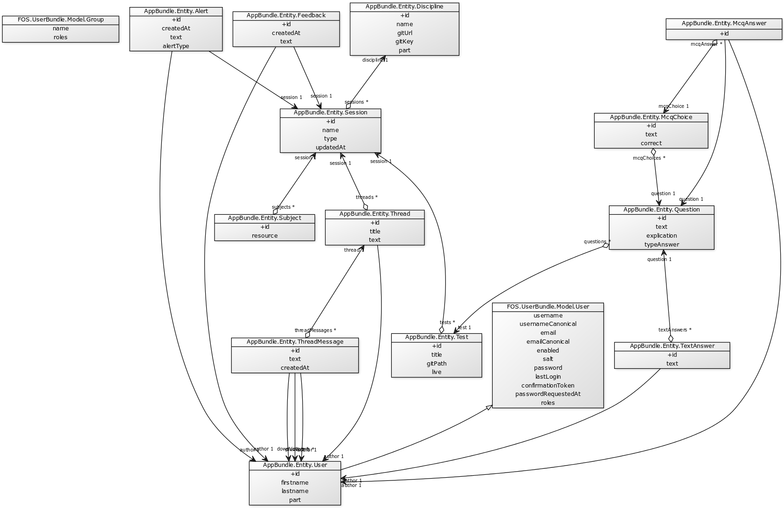

# Architecture

## General architecture

JetPack uses an API-oriented architecture.

The backend is composed of 3 components :

 **The REST API.**
 
 Our platform is API oriented to allow the use of several frontend to display information : a browser website, mobile applications ..
 By exchanging structured JSON objects instead of server-side generated HTMl, we delegate the display of information to the front-end , thus allowing more flexibility and reuse.
 
 We chose [REST](https://en.wikipedia.org/wiki/Representational_state_transfer) to design our API because it is a 
  web-standard to build API. It relies on HTTP verbs and JSON objects.
 
 We use PHP for several reasons : 
  - A stable, widely-used objected oriented language created specificly for web purpose.
  - Some members of our team already had a large experience in that language, contrary to other language (Ruby, Python, Java EE)
  - The existence of an official CAS Client, contrary to NodeJS.
  
  Our API is powered by [API Platform](https://api-platform.com/), a framework dedicated to API Creation. It brings several advantages :
  
   - Standard and recognized solution to create API in PHP
   - Quick and easy to create A CRUD API on a entity model
   - Powered by Symfony, the PHP reference framework. Allow to use Symfony bundles and imposes a clean MVC architecture.
   - Allows the use of web semantic standards

 **A Websocket Engine**
 
 To power real-time exchanges, we use websockets. They are managed by a Websocket engine written in NodeJS.

  **A Message-Queue**
 
 Each of its components as its own docker, as described in docker-compose.yml

## File Architecture

On the root  directory, we can find a traditionnal Symfony architecture

 - app : contains Symfony kernel and configuration files
 - docker: contains various files for Docker
    - apache : files and config for the apache web server (container web)
    - mysql : a volume containing mysql database files. Enable you to drop database container without loosing data
    - tls : a folder to store private key and certificate to use a SSL certificate
    - php : contains php config for web container
 - docs : contains documentation
 - bin : contains Symfony console and other binaries
 - features : contains behavioural testing scenarios and related code
 - src : contains platform business code. In details :
 
    - Action : contains business logic related to API entrypoints.
    - Admin : contains class related to the [admin dashboard](http://localhost/admin)
    - Controller : contains controllers class
    - EventSubscriber: contains the listeners of the entities
    - Entity : contains models classes
    - Resources : contains views
    - Security: contains the voters of the entities
 - src-hmi : [Read the doc in front-end](/docs/browser-front-end/react-architecture.md)
 - src-nodeserver : contains web socket server sources.
 - tests : contains unit tests
 - var: contains all files used by the platform. **that folder should be writable**. In details

    - cache : contains cache of the platform
    - jwt : contains keys for the JWT Authentication system to work
    - logs : contains logs file
    - sessions : contains sessions file
    
 - vendor : contains  Symfony and project [dependencies](https://github.com/projet-aaa/platform/blob/master/docs/back-end/depencies.md)
 - web : contains all web-exposed assets. It is that folder which is Apache DocumentRoot.
 - docs : contains documentation of the project
 
Standalone files are : 

- .gitignore : which files should be indexed or not
- .travis.yml : configures continuous integration parameters
- behat.yml : configures behavioural testing
- composer.json : describes the constraints on Symfony dependencies. Used by [Composer](https://getcomposer.org/) to install dependencies
- composer.lock : contains a solution of the dependencies resolution
- Makefile : some shortcuts for dummies.
- phpunit.xml.dist : PHPUnit configuration

## Entity schema

