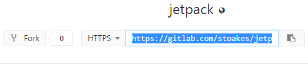
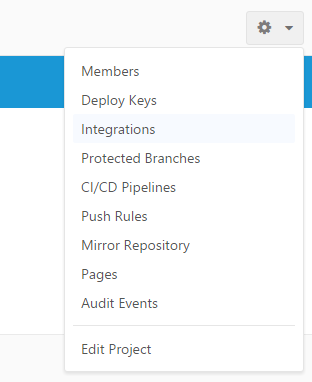
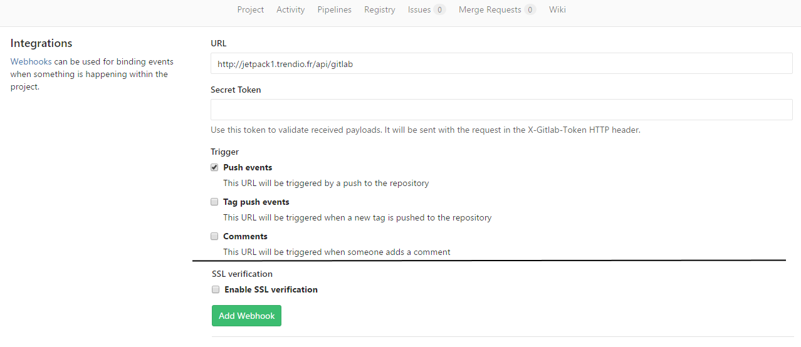
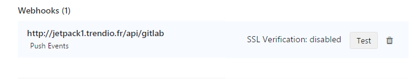

#Integration & Imports

# Integration

Jetpack can understand Gitlab hook sent on /api/gitlab entrypoint

## How to import a test file on Jetpack ?

#### Map a repository with a Discipline

 - To import a file, you should have at least a valid Discipline and a valid Test. If you haven't, create them on Jetpack (Tip : link to admin space [http://your-jetpack.com/admin](http://your-jetpack.com/admin)) 
 
 - Create a public git repository on a gitlab installation.

 - Copy its http link to the gitUrl Discipline field.

 
 
 
 
 
 
 #### Map a Test with a file
 
 - Associate a file name with a Test. The repository will listen to this file modifications to update the test and its question.
 
  

 #### Send Gitlab hooks to Jetpack
 

 - Go to __Integrations__ Menu of your Gitlab repository 
 
 
 
  - Setup a new hook sending push events to 
`http://your_jetpack_url.fr/api/gitlab`. Disable SSl verification if Jetpack has no valid SSL certificate.

 


 - Save the hook, and test it. It should return a 200 HTTP status code. If it doesn't check that you have at least one commit in your repository. At the end it should looks like the following picture.
 
  

 
 - Add a file containing valid YAML to your Gitlab repository.
 
   
  

 - Push your file to the distant repository. The questions and related McqChoice (if any) should be created.
 
 Currently there are no logging system that enables admins or teacher to track issues during the import process.
 
#Imports

Jetpack accepts YAML formatted files to describes tests. 
YAML is a lightweight, human readable description language.[More info on Yaml](https://symfony.com/doc/current/components/yaml/yaml_format.html)
It is based on indentation (**with spaces, not tabs**) to describe a tree.

Here is an example of a well-formed Test description :

```yaml
test:
  title: Questions sur les couleurs et les chevaux
  live: false
  session: REPLACE_WITH_SESSION_ID
  questions:
  # a question expecting a text answer
     - {text: Quel est la couleur du cheval blanc d'Henri 4 ?,
        explication: la réponse est contenue dans la question,
        typeAnswer: text
      }
      #a question with one unique correct answer
     - {text: Quel est la couleur du cheval blanc d'Henri 4 ?, explication: la réponse est contenue dans la question,
        typeAnswer: unique,
        mcqChoices: [{text: Blanc, correct: true},  {text: Noir, correct: false}]
      }
      # a question with several correct answers
     - {text: Quel est la couleur du cheval blanc d'Henri 4 ?,
        explication: la réponse est contenue dans la question,
              typeAnswer: multiple,
              mcqChoices: [{text: Blanc, correct: true},  {text: Noir, correct: false},  {text: Plus blanc que blanc, correct: true}]
          }
```

Images are not supported yet.

You can find a copy of that example [here](./test_import.yml)
